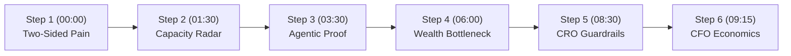

# Demo Presenter Script: Huntington Horizon

This presenter script guides the demonstration of **Huntington Horizon** to Huntington Bancshares Incorporated (HBAN) executive leadership (CEO, CFO, Head of Wealth, Head of Commercial, CRO, and CIO). It articulates the exact customer problem solved, step-by-step presenter actions, visual demo feedback, and how this architecture maps to enterprise Google Cloud production.

---

## 1. Executive Summary & Customer Value Proposition

### 1.1 What Problem Does This Solve?
- **Core Business Pain**: Huntington cannot scale its wealth management franchise simply by asking bankers to work harder. The commercial loan book experiences **$4.5B in annual CRE and middle-market loan payoffs**, generating net equity proceeds ($2M–$10M+) that routinely wire out to Wall Street wirehouses within **48–72 hours** (~78% historical flight rate).
- **The Two-Sided Capacity Bottleneck**:
  - *Commercial RMs*: Focused on loan origination, RMs lack the bandwidth to manually parse title payoff requests, credit agreements, and entity structures (consuming 6–8 hours across 3 siloed systems per deal).
  - *Wealth Advisors (PWAs)*: Even when a lead is captured, manual onboarding takes 2–3 weeks, and ongoing fiduciary servicing caps an advisor at ~80–100 clients. Flooding advisors with leads just moves the bottleneck.
  - *The 1031 Exchange Leakage*: 50–65% of commercial sellers execute IRC §1031 exchanges. If funds touch commercial checking, tax deferral is voided, forcing funds to leak to third-party Qualified Intermediaries (QIs).
- **The Google Cloud Solution**: Powered by the **Gemini Enterprise Agent Platform (fka Vertex AI Platform)** running `gemini-3.7-flash`, Horizon monitors 100% of the payoff book, absorbs commercial discovery (~7 hrs $\rightarrow$ 4 min), pre-stages wealth onboarding and ongoing servicing dossiers (expanding advisor capacity from 80 to 150 accounts), and routes exchange proceeds into institutional 1031 QI escrow custody.
- **Quantifiable Business Impact & ROI**:
  - **Headcount Scaling**: Covers an un-monitorable $4.5B franchise with **zero net new headcount** across Commercial and Wealth.
  - **Deposit & AUM Retention**: Even at an ultra-conservative **5% retention capture floor ($225M)**, Horizon generates **$1.73M gross value ($482.5k net ROI)**, reaching breakeven payback in **8.6 months**. At a 10% target, payback drops to **4.3 months**.

### 1.2 Target Audience & Persona
- **Primary Audience**: Executive Committee (CEO Steve Steinour, CFO Zach Wasserman, Head of Wealth, Head of Commercial, Chief Risk Officer, CIO/CTO).
- **Presentation Tone**: Operational leverage, balance sheet preservation, and institutional compliance (FINRA 2040, GLBA, Reg BI, OCC SR 11-7).

---

## 2. Presenter Pre-Flight Checklist

Before launching the demo:
- [ ] Cloud Run service is active and warm (`https://huntington-horizon-<hash>.a.run.app`).
- [ ] Presenter is authenticated via Identity-Aware Proxy (IAP badge displays `developer@huntington.com`).
- [ ] Browser window is sized to 1920x1080 full screen.
- [ ] Admin Panel gear icon (far right) is verified clickable to access the Brand Kit and this script.
- [ ] Verify backup document (*Apex Logistics Payoff Request.pdf*) is pre-loaded in cache for live stage re-runs.

---

## 3. Step-by-Step Presenter Walkthrough (10-Minute Sequence)

---

### Step 1: The Problem & The $4.5B Flight Cliff (00:00–01:30)
*Establish the reality of commercial deposit flight and the two-sided bottleneck.*

- **Presenter Action**:
  1. Open the Horizon Executive Briefing page.
  2. Frame the core thesis: *"We cannot scale wealth management by asking bankers to work harder. We have $4.5B in annual commercial payoffs that no human team can monitor, and 78% of that liquidity wires out to competitors within 48–72 hours."*
  3. Highlight the two-sided bottleneck: Commercial discovery drag vs. Wealth onboarding/servicing capacity wall.
- **What is Shown in the Demo**:
  - Executive hero displaying $4.5B payoff book, 78% flight rate, and the two-sided bottleneck comparison cards.
- **Production Implementation Blueprint**:
  - BigQuery analytical warehouse tracking historical core deposit wire patterns and historical loan payoff telemetry.

---

### Step 2: Book-Scale Monitoring & Ingestion (01:30–03:30)
*Show how the agent monitors a book no human team could watch.*

- **Presenter Action**:
  1. Switch to the embedded Salesforce FSC 3-pane console.
  2. Point to the **Synthetic Capacity Meter** in Pane 1: *"2,140 events screened, 6 qualified, ~46 hours of manual discovery absorbed this week."*
  3. Highlight First American Title's payoff statement request on Riverfront Commercial Commons surfacing at T-12.
- **What is Shown in the Demo**:
  - Pane 1 Priority Radar with live capacity counter, Pass Tier 2 credit rating badge, and scheduled payoff countdown (14 days to close).
- **Production Implementation Blueprint**:
  - Google Cloud Pub/Sub ingesting AFS & ACBS core loan servicing events into Cloud Run microservices.

---

### Step 3: The "Agentic Proof" Moment (03:30–06:00)
*Demonstrate multimodal reasoning, missing data resolution, and grounded valuation.*

- **Presenter Action**:
  1. Click Marcus Vance. Watch the agent decompose `Vance Riverfront Properties IV, LLC` into Marcus Vance (85%) and Elena Vance (15%).
  2. Emphasize the real-world friction: the title letter omits the contract sale price.
  3. Point out how the agent retrieves trailing Q1 NOI ($637.5k), grounds the 7.5% submarket cap rate via Vertex AI Search, and capitalizes it to $8.5M ($2.9M net equity).
  4. Adjust the **Sale Price Slider** live from $8.5M to $9.0M, watching net proceeds dynamically re-index to $3.35M.
- **What is Shown in the Demo**:
  - Pane 2 interactive household topology map with green bounding-box citations on scanned credit certificates (`⧉ Credit Vault #CC-8821`).
  - Dynamic slider recalculating net equity in real time; 1031 tax strategy toggle.
- **Production Implementation Blueprint**:
  - **Gemini Enterprise Agent Platform (fka Vertex AI Platform)** running `gemini-3.7-flash` with native multimodal document parsing; Vertex AI Search appraisal grounding; Cloud Run `CalculatorTool`.

---

### Step 4: The Human Touch & The Wealth Bottleneck Solved (06:00–08:30)
*Execute the warm banker call, deliver the title wire letter, and demonstrate wealth capacity leverage.*

- **Presenter Action**:
  1. Review RM Greg Miller's 4-minute talk track. Click **[Approve & Deliver Wire Form]**, generating First American Title's disbursement letter.
  2. Toggle the **Persona Switcher** in the header to Sarah Jenkins (Private Wealth Advisor).
  3. Show the pre-staged KYC/CIP, SEI custodial shell, draft IPS framework, and **Automated Quarterly Review Dossier**.
  4. Say: *"We don't just onboard Marcus in 3 days; we enable Sarah to manage 150 clients instead of 80."*
- **What is Shown in the Demo**:
  - Generated Huntington Verified Settlement Wire Instruction PDF.
  - PWA view displaying 80% completed onboarding packet and ongoing quarterly relationship dossier template.
- **Production Implementation Blueprint**:
  - Apigee X API Gateway mTLS routing to SEI Wealth Platform Gateway; DocuSign REST APIs; Cloud Spanner household graph.

---

### Step 5: Institutional Guardrails (CRO Defense) (08:30–09:15)
*Disarm regulatory, privacy, and compliance concerns.*

- **Presenter Action**:
  1. Open the slide-out Compliance Audit Drawer.
  2. Review the four green institutional verification badges:
     - **FINRA Rule 2040**: 100% Shadow Deposit Credit on RM scorecard; zero securities fee-splitting.
     - **GLBA Quarantined Consent Gate**: Staged wealth profiles remain isolated until RM records verbal opt-in.
     - **OCC SR 11-7 Triage Designation**: Valuations classified as relationship triage, exempt from full-scale credit validation.
     - **1031 QI Escrow Custody**: Institutional escrow preserving deposits during 180-day exchange window.
- **What is Shown in the Demo**:
  - Compliance drawer with tamper-evident audit hashes and zero-data-logging boundary certifications.
- **Production Implementation Blueprint**:
  - Cloud KMS customer-managed encryption keys (CMEK); VPC Service Controls (VPC-SC perimeter); Cloud Audit Logs immutable trail.

---

### Step 6: Financial ROI & CFO Hand-off (09:15–10:00)
*Prove the financial justification with defensible sensitivity modeling.*

- **Presenter Action**:
  1. Show Layer A (Zero net new headcount across Commercial and Wealth).
  2. Slide Layer B ROI from 5% ($482k net ROI, 8.6 mo payback) to 10% ($2.2M net ROI, 4.3 mo payback).
  3. Show the componentized $1.25M enterprise cloud run-rate defense.
  4. Hand the floor to CFO Zach Wasserman for discussion.
- **What is Shown in the Demo**:
  - Dual-sided capacity matrix; interactive sensitivity table with net annual ROI and breakeven payback.
- **Production Implementation Blueprint**:
  - Client-side tabular calculation engine; BigQuery ROI baseline model.
