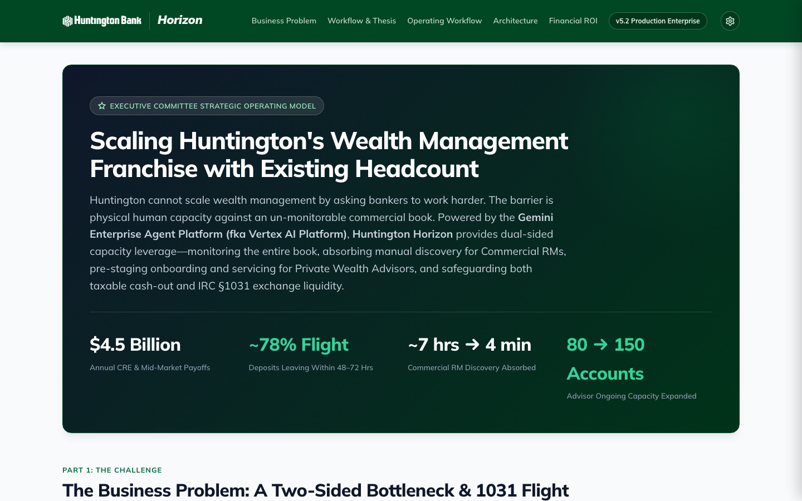

# Huntington Horizon: Intelligent Liquidity Orchestration

Production-grade, interactive full-stack Google Cloud Run application for **Huntington Horizon: Intelligent Liquidity Orchestration**. Built strictly in accordance with the **Google Cloud Run Demo Standard** (`/cloud-run-demo`), the approved **Huntington Bank Corporate Design Specification** (`DESIGN.md`, `brand_kit.html`), and **Functional Specifications** (`PRD.md`, `DEMO_SCRIPT.md`).

---

## 1. Executive Summary & Core Thesis

Huntington cannot scale its wealth management franchise simply by asking bankers to work harder. The commercial loan book experiences **$4.5B in annual CRE and middle-market loan payoffs**, with **~78% of net liquidity wiring out to external competitors within 48–72 hours**.

### The Two-Sided Capacity Bottleneck
1. **Commercial Side:** Commercial RMs focus on loan production and lack the bandwidth for 6–8 hours of manual discovery, entity resolution, and valuation across siloed systems per deal.
2. **Wealth Side (Onboarding & Ongoing Servicing):** Manual onboarding takes 2–3 weeks, and ongoing fiduciary servicing caps Private Wealth Advisors (PWAs) at ~80–100 accounts. Flooding advisors with leads trades a commercial bottleneck for an acute wealth bottleneck.
3. **The 1031 Exchange Leakage:** 50–65% of commercial property dispositions execute an IRC §1031 like-kind exchange. If funds touch commercial operating checking, tax deferral is voided, forcing funds to leak to third-party Qualified Intermediaries (QIs).

### The Solution: Dual-Sided Agentic Capacity Leverage
Powered by the **Gemini Enterprise Agent Platform (fka Vertex AI Platform)** running `gemini-3.7-flash`:
- **Monitors 100% of the $4.5B book** for title payoff statement requests in real time.
- **Absorbs Commercial Discovery**: Extracts borrowing LLCs to beneficial owners with verified document grounding, resolving unstated contract sale prices via trailing NOI grounded by Vertex AI Search (~7 hrs → 4 min).
- **Automates Wealth Scaffolding**: Pre-stages KYC/CIP, SEI custodial shell, and draft IPS behind a **GLBA Quarantined Consent Gate**, and automates ongoing quarterly review dossiers (expanding advisor capacity from 80 to 150 accounts).
- **Safeguards 1031 Exchange Liquidity**: Automatically routes exchange proceeds to the **Huntington 1031 Qualified Escrow Depository (Partner QI Network)** under Treas. Reg. § 1.1031(k)-1(g)(3), preserving deposits on balance sheet for 180 days.
- **Zero Net New Headcount**: Scales the franchise across both Commercial and Wealth with existing staff.

---

## 2. Visual Interface & Workflow Previews

### Commercial Payoff Pipeline
Surveillance on active payoff demands, upcoming loan maturities, and deposit retention opportunities across Huntington commercial relationships.


### Executive Strategic Operating Model
End-to-end executive briefing detailing the two-sided capacity leverage thesis, regulatory defense matrix, and financial ROI.


### Huntington Corporate Brand Kit
Interactive design system showcasing corporate green palettes (`#004724`, `#006738`, `#7ECF1C`), Swiss technical typography, and accessible component states.


---

## 3. Technical Monostack Architecture

```
┌─────────────────────────────────────────────────────────────────────────────────────────────────┐
│                                  HUNTINGTON HORIZON MONOSTACK                                   │
├───────────────────────────────┬─────────────────────────────────┬───────────────────────────────┤
│ FRONTEND (React 18 + Vite)    │ REASONING ORCHESTRATOR          │ CLOUD RUN DEPLOYMENT          │
│ • Tailwind CSS + shadcn/ui    │ • Gemini Enterprise Agent       │ • python:3.11-slim Container  │
│ • Swiss Minimalist Console    │   Platform (gemini-3.7-flash)   │ • Non-root appuser execution  │
│ • Multi-View Banking Workflow │ • Vertex AI Search Grounding    │ • Cloud Run Native Direct IAP │
│ • Dual Persona Navigation     │ • Deterministic Tools           │   (--iap --no-invoker-iam)    │
│ • Dynamic Sale Price Slider   │   - Valuation Calculator        │ • Scale-to-Zero Idle (0-3)    │
│ • 1031 Strategy Fork Toggle   │   - 1031 Exchange Detector      │ • Zero SA Keys (ADC / Runtime)│
│ • Mandatory Admin Panel       │   - Exclusion Sentry Filter     │ • Least Privilege IAM         │
└───────────────────────────────┴─────────────────────────────────┴───────────────────────────────┘
```

- **Frontend (`frontend/`)**: React 18 single-page application built with Vite, TypeScript, and Tailwind CSS. Includes bounded `vite:preloadError` retry guard and anti-caching meta tags.
- **Backend (`main.py`)**: Python 3.11 FastAPI backend featuring native Gemini Enterprise Agent Platform integration, cryptographic IAP JWT verification with public key caching (`iap_jwt_middleware.py`), and hardened static SPA router with path-traversal protection.
- **Security & Governance**: Zero hardcoded secrets, DRS org policy compliance, GLBA technical information barrier, and FINRA Rule 2040 non-fee splitting compliance.

---

## 4. Identity-Aware Proxy (IAP) & DRS Compliance

This application strictly implements **Cloud Run Direct IAP** per the `/cloud-run-demo` specification:

1. **Direct IAP Flags**: Deployed with `--iap --no-invoker-iam-check --no-allow-unauthenticated --ingress=all`.
   - **Service-to-Service IAM Disabled (`--no-invoker-iam-check`)**: Browser end-users do not require project-level `roles/run.invoker`.
   - **Direct Resource Binding**: Authorized user domains (e.g. `domain:google.com`) are granted `roles/iap.httpsResourceAccessor` directly on the Cloud Run IAP resource policy.
2. **DRS Org Policy Protection**: **Never adds `domain:google.com` to project-level IAM**, completely preventing Domain Restricted Sharing (`constraints/iam.allowedPolicyMemberDomains`) policy violations.
3. **IAP Service Agent Authorization**: `roles/run.invoker` is granted specifically to the IAP service identity (`service-${PROJECT_NUMBER}@gcp-sa-iap.iam.gserviceaccount.com`), provisioned via `gcloud beta services identity create --service=iap.googleapis.com`.
4. **IAP Allowed Domains**: The Cloud Run domain (`https://${APP_NAME}-<hash>-<region>.a.run.app`) is added to **Allowed Domains** under IAP Settings (`gcloud iap settings set` or Google Cloud Console) to authorize browser OAuth redirects.
5. **Cryptographic JWT Verification**: In production, `iap_jwt_middleware.py` intercepts requests, fetches Google's public certificates with in-memory caching (`CachedIapTransportRequest`), and verifies:
   - **Audience**: `/projects/${PROJECT_NUMBER}/locations/${GCP_REGION}/services/${APP_NAME}`
   - **Issuer**: `https://cloud.google.com/iap`
   - **Domain**: Matches `IAP_ALLOWED_DOMAINS` allowlist.

---

## 5. Quickstart & Local Development

### Prerequisites
- Python 3.11+
- Node.js 18+ and npm
- Google Cloud SDK (`gcloud`) with ADC configured for live Gemini Enterprise Agent Platform calls:
  ```bash
  gcloud auth application-default login
  ```

### Local Dev Orchestrator
Run both the FastAPI backend and Vite frontend proxy concurrently bound strictly to `127.0.0.1`:
```bash
./run_local.sh
```
- **Frontend SPA**: `http://127.0.0.1:5173`
- **Backend API**: `http://127.0.0.1:8080`
- **Admin Panel**: Click the gear icon on the far right of the top navigation header.
- **Interactive Brand Kit**: `http://127.0.0.1:5173/brand_kit.html` (or `http://127.0.0.1:8080/brand_kit.html`)
- **Workflow & Operating Guide**: `http://127.0.0.1:5173/demo_script.html` (or `http://127.0.0.1:8080/demo_script.html`)

### Manual Verification Commands
- **Backend Import & Boot**:
  ```bash
  source .venv/bin/activate
  uvicorn main:app --host 127.0.0.1 --port 8080
  ```
- **Frontend Compilation & Build**:
  ```bash
  cd frontend && npm run build
  ```
- **Strict Zero-Emoji Rule Verification**:
  ```bash
  ! LC_ALL=C grep -rn '[^ -~	]' frontend/src/ && echo "PASS: STRICT ZERO-EMOJI RULE VERIFIED"
  ```

---

## 6. API Endpoints Reference

| Endpoint | Method | Description |
| :--- | :---: | :--- |
| `/api/health` | GET | Diagnostic telemetry (Platform, Model, Project, Service, IAP status). |
| `/api/user` | GET | Authenticated Google / IAP user profile (`developer@google.com` locally). |
| `/api/payoffs` | GET | Inbound commercial servicing queue items with Synthetic Capacity Meter. |
| `/api/entity-resolution` | GET | Gemini 3.7 Flash multimodal document extraction with verified entity records. |
| `/api/valuation` | POST | Deterministic valuation calculator, loan payoff, net proceeds, and yield math. |
| `/api/quarantine` | GET/POST | GLBA Quarantined Consent Gate status check and verbal opt-in toggle. |
| `/api/wire-instructions` | GET | Generates verified First American Title Settlement Wire Instruction data. |
| `/api/wealth-onboarding` | GET | Pre-staged KYC/CIP, SEI custodial shell, draft IPS, and quarterly review. |
| `/api/generate` | POST | Native Gemini 3.7 Flash generation with high-fidelity realistic fallbacks. |

---

## 7. Operational Workflow (The 10-Minute Walkthrough)

Detailed in [`DEMO_SCRIPT.md`](DEMO_SCRIPT.md) and viewable interactively at `/demo_script.html`:

1. **Step 1 (00:00–01:30) - The Problem & The $4.5B Flight Cliff**: Review the two-sided capacity bottleneck: Commercial discovery drag (~7 hrs) vs. Wealth onboarding/servicing capacity limit (80 accounts).
2. **Step 2 (01:30–03:30) - Commercial Payoff Surveillance**: Inspect the commercial loan payoff queue. Review Riverfront Commercial Commons at T-12 days with imminent 78% flight risk.
3. **Step 3 (03:30–06:00) - Credit & Title Verification**: Select Marcus Vance. Gemini 3.7 Flash decomposes `Vance Riverfront Properties IV, LLC` with verified entity grounding on scanned credit certificates. Resolve unstated contract sale price via trailing NOI ($637.5k) capitalized at 7.50% cap rate grounded via Vertex AI Search. Adjust the **Sale Price Slider** live from $8.5M to $9.0M, dynamically recalculating net proceeds to $3.35M.
4. **Step 4 (06:00–08:30) - Deposit Retention & Wealth Referral**: Review Greg Miller's relationship call guide. Configure Huntington 1031 Qualified Escrow Depository or Commercial Max$aver sweep. Record GLBA verbal consent, generate title wire instructions, and hand off to Private Wealth Advisor Sarah Jenkins.
5. **Step 5 (08:30–09:15) - Institutional Guardrails (CRO Defense)**: Review regulatory compliance checks for FINRA Rule 2040, GLBA Quarantined Consent Gate, OCC SR 11-7 Triage Designation, and IRC §1031 Qualified Escrow Safe Harbor.
6. **Step 6 (09:15–10:00) - Financial ROI & Capacity Economics**: Slide the Retention Capture Slider from 5% ($482.5k net ROI, 8.6 mo payback) to 10% ($2.2M net ROI, 4.3 mo payback). Review the componentized $1.25M enterprise run-rate defense.

---

## 8. Cloud Run Production Deployment & Teardown

### Deploying to Cloud Run
Deploy to Google Cloud Run with Direct IAP, Secret Manager, and Gemini Enterprise Agent Platform:
```bash
./deploy.sh
```
`deploy.sh` automatically:
- Validates parameters and service account naming constraints ($\le 30$ chars).
- Enables required Google Cloud APIs (`run.googleapis.com`, `iap.googleapis.com`, `aiplatform.googleapis.com`, `secretmanager.googleapis.com`, etc.).
- Builds the container via Cloud Build and deploys to Cloud Run with `--iap --no-invoker-iam-check --no-allow-unauthenticated`.
- Provisions the IAP service agent and binds `roles/run.invoker`.
- Configures Allowed Domains under IAP settings.

### Safe Teardown
To safely tear down all Cloud Run infrastructure without deleting shared Secret Manager secrets:
```bash
./destroy.sh
```
For non-interactive automation:
```bash
./destroy.sh --force
```

---
*Huntington Horizon v5.2 — Proving dual-sided agentic capacity leverage: scaling wealth management with existing headcount across both Commercial and Wealth.*
