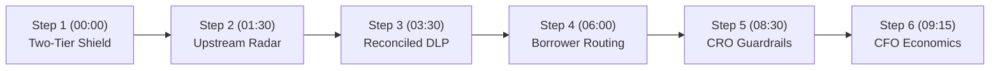

# Demo Presenter Script: Huntington Horizon 2.0
## Institutional Liquidity & Treasury Orchestration (v6.0)

This presenter script guides the demonstration of **Huntington Horizon 2.0** to Huntington Bancshares Incorporated (HBAN) executive leadership (CEO Steve Steinour, CFO Zach Wasserman, Head of Commercial Banking, Head of Wealth Management, Chief Risk Officer, and CIO/CTO). It articulates the customer and balance-sheet problem, step-by-step presenter actions, visual demo feedback, and how this architecture maps to enterprise Google Cloud production under real banking regulations.

---

## 1. Executive Summary & Customer Value Proposition

### 1.1 What Problem Does This Solve?
- **Core Business Pain**: Huntington cannot scale its wealth management and commercial deposit franchise simply by asking bankers to work harder. The commercial loan book experiences **$4.5B in annual commercial real estate (CRE), middle-market, and SBA 7(a) loan payoffs** across **1,400 branches in 21 states**, generating net equity proceeds ($2M–$10M+) that routinely wire out to Wall Street wirehouses within **48–72 hours** (~78% historical flight rate).
- **The Operational Disconnect**:
  - *The 6-Month Exit Marathon vs. 11th-Hour Payoff Demand*: Commercial dispositions and SBA business sales take 6–9 months. Arriving only when a title payoff demand arrives at T-14 means Huntington is engaging at the finish line after CPAs, QIs, and external wealth managers have already been selected.
  - *Commercial Servicing Intake Latency*: Title payoff faxes and emails sent to `commercial.payoffs@huntington.com` take loan ops 3–5 business days to process manually, leaving bankers with zero operational lead time.
  - *Retail Wealth Channel Non-Affiliation (Ameriprise Platform)*: With Huntington Advisors operating on Ameriprise Financial's platform (announced Feb 4, 2026), retail wealth is legally a non-affiliated third party under GLBA Regulation P. Commercial RMs are governed by an SEC Regulation R Networking Arrangement and cannot receive securities transaction commissions.
  - *Private Wealth Servicing Physics*: Advisors are constrained by high-touch fiduciary maintenance (quarterly reviews, tax strategy, emotional coaching), not clerical paperwork. Flooding advisors with raw leads degrades service and causes AUM churn.
  - *The 1031 Exchange Leakage*: 50–65% of commercial property dispositions execute IRC §1031 like-kind exchanges. Under Treas. Reg. § 1.1031(k)-1(k), Huntington cannot act as the Qualified Intermediary. Unless Huntington provides an institutional Qualified Escrow Depository partnered with an independent QI, exchange funds legally must wire out.
- **The Horizon 2.0 Solution**: Powered by the **Gemini Enterprise Agent Platform (fka Vertex AI Platform)** running `gemini-3.7-flash`:
  - **Tier 1 (Commercial Balance Sheet Retention — Day 0)**: Retains 100% of entity net proceeds in **Business Premier Insured Cash Sweep (ICS)** at 4.85% APY (multi-million FDIC insurance) or **Institutional 1031 Qualified Escrow Depository**, capturing 85 bps net NIM on Day 0.
  - **Tier 2 (Post-Distribution Wealth Advisory — Day T+30 to T+60)**: Respects corporate entity boundaries, engaging sponsors after CPA tax distributions. Routes sub-$3M transactional liquidity to the Centralized Wealth Advisory Hub and connects Huntington Private Bank to modern **SEI Data Cloud** (announced March 31, 2026) via Snowflake Secure Data Sharing.
- **Quantifiable Business Impact & ROI**:
  - **Headcount Scaling**: Achieves **2x CSA operational leverage** (1 CSA : 4 PWAs) and sustainably expands senior PWA capacity from 80 to **95–100 relationships (+20–25%)**, with zero net new commercial headcount across 1,400 branches.
  - **Deposit & Net Value**: At an ultra-conservative **5% retention capture floor ($225M)**, Horizon 2.0 generates **$1.755M gross value ($505k net ROI)**, reaching breakeven payback in **8.5 months**. At a 10% target ($450M retained), net ROI rises to **$2.26M/year (4.3 mo payback)**.

### 1.2 Target Audience & Persona
- **Primary Audience**: Executive Committee (CEO Steve Steinour, CFO Zach Wasserman, Head of Wealth, Head of Commercial, Chief Risk Officer, CIO/CTO).
- **Presentation Tone**: Rigorous operational leverage, balance sheet preservation, and institutional compliance (ALTA Pillar 2, GLBA Reg P, SEC Reg R, FINRA 2040, SEC Reg BI, OCC SR 11-7, Treas. Reg. § 1.1031(k)-1).

---

## 2. Presenter Pre-Flight Checklist

Before launching the demo:
- [ ] Cloud Run service is active and warm (`https://huntington-horizon-<hash>.a.run.app`).
- [ ] Presenter is authenticated via Identity-Aware Proxy (IAP badge displays `developer@huntington.com`).
- [ ] Browser window is sized to 1920x1080 full screen.
- [ ] Admin Panel gear icon (far right) is verified clickable to access the Brand Kit and this script.
- [ ] Verify backup document (*Apex Logistics Payoff Request.pdf*) is pre-loaded in cache for live stage re-runs.

---

## 3. Step-by-Step Presenter Walkthrough (10-Minute Sequence)

---

### Step 1: The Problem & The $4.5B Flight Cliff (00:00–01:30)
*Establish the reality of commercial and SBA deposit flight across Huntington's 1,400 branches and frame the Two-Tier Retention Shield.*

- **Presenter Action**:
  1. Open the Horizon Executive Briefing page.
  2. Frame the core thesis: *"We cannot scale wealth management by asking bankers to work harder. We experience $4.5B in annual commercial payoffs across 1,400 branches in 21 states. As a top-2 SBA 7(a) lender nationally, our book is packed with middle-market business sales and commercial property dispositions. Historically, 78% of that liquidity wires out to competitors within 48–72 hours."*
  3. Highlight the two-tier solution:
     - *"Horizon 2.0 does not try to jam personal wealth products down a commercial sponsor's throat 12 days before closing. We separate Tier 1 Commercial Treasury Retention—locking the entity's funds in Business Premier ICS or 1031 Qualified Escrow on Day 0—from Tier 2 Post-Distribution Wealth Advisory at Day 30 to 60, after the sponsor's CPA has executed partnership tax distributions."*
- **What is Shown in the Demo**:
  - Executive hero displaying $4.5B payoff book, 78% flight rate ($3.51B at risk), 21-state footprint, and the Two-Tier Retention Shield diagram.
- **Production Implementation Blueprint**:
  - BigQuery analytical warehouse tracking historical core deposit wire patterns, SBA 7(a) portfolio registers, and historical loan payoff telemetry.

---

### Step 2: Dual-Horizon Surveillance & Intake Ingestion (01:30–03:30)
*Show how the agent captures upstream exit signals at T-120 and ingests payoff demands at T-14 via the Loan Operations communication perimeter.*

- **Presenter Action**:
  1. Switch to the embedded Salesforce FSC 3-pane console.
  2. Point to the **Operational Capacity Metrics** in Pane 1: *"1,400 branches monitored, 2,140 events screened, 6 qualified commercial leads, 2x CSA leverage active."*
  3. Explain the upstream surveillance: *"We don't wait for the payoff demand. Horizon screens loan facility maturities at T-120 and T-90, and flags tenant estoppel requests at T-60 so bankers engage during transaction planning."*
  4. Highlight First American Title's payoff demand on Riverfront Commercial Commons surfacing at T-12:
     - *"When the payoff demand arrived from First American, it didn't wait in a loan ops inbox. Horizon ingested the inbound eFax via Microsoft Graph API and RightFax, extracting the loan account and borrower LLC 72 hours before loan ops keyed the quote into AFS."*
- **What is Shown in the Demo**:
  - Pane 1 Priority Radar with live capacity counter, Pass Tier 2 credit rating badge, scheduled payoff countdown (14 days to close), and global obligor MDM screening pass.
- **Production Implementation Blueprint**:
  - Microsoft Graph API + OpenText RightFax ingesting incoming payoff faxes/emails into Cloud Run event-driven microservices; Snowflake core read-replica loan master.

---

### Step 3: Reconciled Entity Intelligence & Internal Liquidity Triage (03:30–06:00)
*Demonstrate multimodal extraction with pre-ingestion DLP, non-guarantor privacy exclusions, and internal triage heuristics under OCC SR 11-7.*

- **Presenter Action**:
  1. Click Marcus Vance. Watch the agent decompose `Vance Riverfront Properties IV, LLC` with verified citations on scanned credit certificates (`⧉ nCino Facility #CC-8821`).
  2. Point out the **Automated Pre-Ingestion DLP**:
     - *"Notice what the agent did NOT ingest. It purged consumer credit bureaus, personal 1040s, and FinCEN CDD records before processing. Elena Vance—a 15% non-guarantor member—is programmatically excluded. Because Huntington Advisors operates on Ameriprise's platform as a non-affiliated third party, this strict data firewall is non-negotiable under GLBA Regulation P."*
  3. Point out the **Internal Liquidity Triage Indicator**:
     - *"The title letter omits the contract sale price. Rather than having an AI hallucinate an appraisal, Horizon references the underwritten $8.0M baseline and trailing Q1 NOI ($637.5k) to establish an internal triage range of $2.5M to $3.3M. This calculation is strictly muzzled from the client; Greg Miller never asserts a property value to Marcus Vance."*
  4. Adjust the **Sale Price Slider** live from $8.5M to $9.0M, watching net proceeds dynamically re-index to $3.35M.
- **What is Shown in the Demo**:
  - Pane 2 interactive entity map with green bounding-box citations on credit agreements; non-guarantor exclusion flags; dynamic slider recalculating net equity in real time; 1031 tax strategy toggle.
- **Production Implementation Blueprint**:
  - **Gemini Enterprise Agent Platform (fka Vertex AI Platform)** running `gemini-3.7-flash`; Google Cloud DLP; nCino REST integration; Cloud Run `CalculatorTool`.

---

### Step 4: Consultative Commercial Call & Borrower-Directed Routing (06:00–08:30)
*Execute the warm banker call, inspect the live DocuSign routing packet delivered directly to the borrower, and showcase modern SEI Data Cloud wealth integration.*

- **Presenter Action**:
  1. Review RM Greg Miller's relationship briefing:
     - *"Notice Greg is not pitching wealth products. He is pitching closing safety: guaranteeing Marcus that his entity's $2.9M net proceeds land in a Business Premier account backed by Insured Cash Sweep (ICS) for multi-million FDIC insurance at 4.85% APY."*
  2. Inspect the live **Borrower Settlement Routing Packet** in the right workspace:
     - *"Here is the fatal flaw we fixed: lenders have zero legal standing to direct seller proceeds to title companies. Title companies reject lender wire letters out of hand under ALTA Pillar 2 wire fraud rules. Horizon generates a verified Huntington Settlement Account Routing Packet delivered directly to Marcus Vance via DocuSign (Envelope `ENV-HBAN-20260904-8821`). Marcus executes and submits it as his official Seller Closing Authorization to First American Title, accompanied by Huntington's official bank verification letter for mandatory call-back authentication on `(614) 480-4401`."*
  3. Click **[Record Client Opt-In]** to lift the GLBA Privacy Gate:
     - *"Clicking Record Client Opt-In logs Marcus's affirmative verbal consent with a cryptographic 64-character SHA-256 audit hash, unlocking the dual-sided handoff to Private Wealth while maintaining full compliance with Regulation R and Ameriprise data firewalls."*
  4. Click **[Proceed to Private Wealth Intake (Sarah Jenkins)]** (or toggle the **Persona Switcher** in the header):
     - *"At Day T+30, after Marcus's CPA has executed partnership distributions, Sarah Jenkins engages. We don't burden Sarah with manual data entry or legacy trust batch files. Huntington Private Bank's migration to the SEI Wealth Platform and SEI Data Cloud (announced March 31, 2026) enables real-time Snowflake Zero-ETL data sharing, delivering verified relationship dossiers under strict SEC Regulation Best Interest governance."*
- **What is Shown in the Demo**:
  - Live DocuSign routing packet with official Huntington National Bank Account Verification Letter and direct callback authentication line.
  - Wealth Hub view displaying staged institutional facts with SEI Data Cloud connectivity and zero AI-generated model portfolios.
- **Production Implementation Blueprint**:
  - DocuSign REST APIs; Apigee X API Gateway mTLS; SEI Data Cloud via Snowflake Secure Data Sharing; Cloud Spanner household graph.

---

### Step 5: Institutional Guardrails (CRO Defense) (08:30–09:15)
*Disarm regulatory, privacy, title fraud, and model risk concerns.*

- **Presenter Action**:
  1. Navigate to **Executive Analytics** and select the **Corporate Governance (CRO Defense)** tab.
  2. Review the six green institutional verification badges:
     - **ALTA Pillar 2 & UCC 4A**: Wire instructions delivered to the borrower for seller authorization; official bank verification letter for callback authentication.
     - **GLBA Pre-Ingestion DLP**: Consumer bureaus and personal NPI purged; Ameriprise non-affiliated third-party barrier enforced.
     - **Ameriprise Regulation R Networking**: Commercial RM receives 100% hard-dollar commercial deposit FTP credit; zero securities fee-splitting.
     - **1031 Qualified Escrow Safe Harbor**: Institutional escrow partnered with independent QI (IPX1031); in-house DST securities cross-selling strictly firewalled under Treas. Reg. § 1.1031(k)-1(k).
     - **OCC SR 11-7 Model Tier 3**: Classified as an internal relationship triage heuristic, exempt from credit AVM validation; client-facing valuation muzzled.
     - **SEI Data Cloud Integration**: Modern cloud-native Snowflake data exchange, eliminating legacy on-premise Trust 3000 batch files.
- **What is Shown in the Demo**:
  - Comprehensive Corporate Governance & CRO Defense matrix with tamper-evident audit hashes, zero-data-logging boundary certifications, and statutory citations.
- **Production Implementation Blueprint**:
  - Cloud KMS customer-managed encryption keys (CMEK); VPC Service Controls (VPC-SC perimeter); Cloud Audit Logs immutable trail.

---

### Step 6: Financial ROI & CFO Hand-off (09:15–10:00)
*Prove the financial justification with defensible sensitivity modeling and realistic capacity economics.*

- **Presenter Action**:
  1. Show Layer A Capacity Economics:
     - *"We do not claim an advisor can manage 150 accounts—fiduciary maintenance makes that impossible. We achieve 2x operational leverage for Client Service Associates (1 CSA supporting 4 advisors), cap senior PWAs at 95–100 accounts (+20–25%), and route sub-$3M transactional liquidity to our Centralized Wealth Advisory Hub."*
  2. Slide Layer B ROI from 5% ($505k net ROI, 8.5 mo payback) to 10% ($2.26M net ROI, 4.3 mo payback).
  3. Show the componentized $1.25M enterprise cloud run-rate defense.
  4. Hand the floor to CFO Zach Wasserman for discussion.
- **What is Shown in the Demo**:
  - Dual-sided capacity matrix; interactive sensitivity table with net annual ROI and breakeven payback.
- **Production Implementation Blueprint**:
  - Client-side tabular calculation engine; BigQuery ROI baseline model.

---

## 4. Anticipated Executive Q&A (Presenter Defense)

* **"How does the Ameriprise partnership impact client data sharing?"**  
  → Because Huntington Advisors operates on Ameriprise Financial's platform (announced Feb 4, 2026), the retail broker-dealer channel is a non-affiliated third party under GLBA Regulation P. Commercial borrower data cannot be transferred to Ameriprise without explicit affirmative opt-in consent. Horizon 2.0 quarantines all commercial credit data at the bank perimeter and operates under an SEC Regulation R Networking Arrangement, ensuring Commercial RMs receive bank deposit FTP credit only and zero securities fee-splitting.

* **"How does Horizon 2.0 connect to Huntington Private Bank's wealth platform?"**  
  → We integrate natively with the **SEI Wealth Platform (SWP)** via the **SEI Data Cloud** (announced March 31, 2026). This utilizes Snowflake Secure Data Sharing (Zero-ETL) to securely exchange portfolio telemetry and verify account status in real time, completely bypassing legacy on-premises trust accounting batch files like Trust 3000.

* **"Why does Huntington's top-2 SBA 7(a) lender status matter for this platform?"**  
  → Huntington's commercial payoff book is not just suburban office buildings. Across 1,400 branches in 21 states, Huntington leads the nation in SBA 7(a) lending. SBA loan payoffs represent business sales, acquisitions, and entrepreneur retirements—inflection points where middle-market business owners experience multi-million-dollar liquidity windfalls. Horizon 2.0 monitors SBA 7(a) maturity queues and SOP 50 10 7 prepayment notices to capture entrepreneur wealth.

* **"Why don't we deliver wire instructions directly to the title company?"**  
  → Because lenders have zero legal standing to direct seller proceeds. Under ALTA Pillar 2 and UCC Article 4A, title companies disburse seller equity strictly pursuant to the Seller's Closing Disbursement Instructions executed by the seller. Delivering lender instructions directly to title creates wire fraud liability and is rejected out of hand. Horizon 2.0 generates a verified routing packet delivered to Marcus Vance via DocuSign, who submits it as his official seller instruction backed by our official bank verification letter.

* **"What prevents Huntington from being disqualified on a 1031 exchange?"**  
  → Horizon 2.0 strictly firewalls 1031 escrow from wealth management and Delaware Statutory Trust (DST) placement desks. Huntington National Bank acts solely as the institutional escrow depository under an independent, unaffiliated national Qualified Intermediary (IPX1031). By prohibiting in-house DST securities sales during the 180-day window, we remain firmly within the Treas. Reg. § 1.1031(k)-1(k)(2)(ii) routine banking safe harbor.

* **"Why does it cost $1.25M annually to run this platform?"**  
  → Raw AI compute is minimal ($25k/yr). The $1.25M fully-loaded budget funds enterprise Cloud Spanner, Apigee X API gateway integration, SEI Data Cloud connectivity, annual SOC2 and OCC SR 11-7 model validations, and a dedicated 2-person platform engineering and MLOps pod.

---
*Huntington Horizon 2.0 Presenter Script (v6.0) — Engineered for real-world banking execution, regulatory compliance, and balance sheet preservation.*
