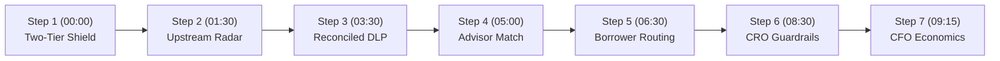

# Demo Presenter Script: Huntington Book Scout
## Institutional Liquidity & Treasury Orchestration (v6.0)

This presenter script guides the demonstration of **Huntington Book Scout** to Huntington Bancshares Incorporated (HBAN) executive leadership (CEO Steve Steinour, CFO Zach Wasserman, Head of Commercial Banking, Head of Wealth Management, Chief Risk Officer, and CIO/CTO). It articulates the customer and balance-sheet problem, step-by-step presenter actions, visual demo feedback, and how this architecture maps to enterprise Google Cloud production under real banking regulations.

---

## 1. Executive Summary & Customer Value Proposition

### 1.1 What Problem Does This Solve?
- **Core Business Pain**: Huntington cannot scale its wealth management and commercial deposit franchise simply by asking bankers to work harder. Against a **$33.30B target commercial book** across **1,400 branches in 21 states**, roughly **$7.49B of payoff volume — about 2,497 liquidity events — turns over each year**, generating net equity proceeds ($2M–$10M+) that routinely wire out to Wall Street wirehouses within **48–72 hours**.
- **The Operational Disconnect**:
  - *The 6-Month Exit Marathon vs. 11th-Hour Payoff Demand*: Commercial dispositions and SBA business sales take 6–9 months. Arriving only when a title payoff demand arrives at T-14 means Huntington is engaging at the finish line after CPAs, QIs, and external wealth managers have already been selected.
  - *Commercial Servicing Intake Latency*: Title payoff faxes and emails sent to `commercial.payoffs@huntington.com` take loan ops 3–5 business days to process manually, leaving bankers with zero operational lead time.
  - *Cross-Line-of-Business Handoff Governance (Ameriprise Platform)*: Under the **Huntington Financial Advisors (HFA)** arrangement, **the advisors are Huntington employees and the clients remain Huntington customers** — Ameriprise supplies the technology platform, clearing and back office, and acts as the **supervising broker-dealer**. So the commercial-to-wealth handoff is an *intra-institutional* transfer, not a disclosure to a non-affiliated third party. Ameriprise's receipt of client NPI through the platform is governed as a **service-provider relationship under Reg P (12 C.F.R. § 1016.13)** — contractual confidentiality and use restrictions, not customer opt-out. What *does* bind the commercial RM is the **SEC Regulation R networking exception**: as an unregistered bank employee, Greg Miller may receive only a nominal, fixed-dollar, non-contingent referral fee and no securities transaction compensation.
    > ⚠️ **Presenter caution — know which channel you're describing.** The Feb 4, 2026 Ameriprise release covers the **retail investment program (HFA)** only. Huntington **Private Bank** trust/discretionary business runs on **SEI** and is a *bank fiduciary* activity under **OCC Reg 9** — Reg BI, FINRA 2111 and Ameriprise supervision **do not apply** to it. If a CRO or GC asks why a "Senior Private Wealth Advisor" handoff is labeled Ameriprise-supervised, acknowledge the tiering: Tier A ($3M+) is Private Bank fiduciary; Tier B (sub-$3M, Centralized Wealth Hub) is the HFA/Ameriprise retail channel. See `CITATIONS.md` §1a.
  - *Private Wealth Servicing Physics*: Advisors are constrained by high-touch fiduciary maintenance (quarterly reviews, tax strategy, emotional coaching), not clerical paperwork. Flooding advisors with raw leads degrades service and causes AUM churn.
  - *The 1031 Exchange Leakage*: a substantial share of commercial property dispositions — industry estimates commonly cited in the 50–65% range, not a figure Huntington has published — execute IRC §1031 like-kind exchanges. Under Treas. Reg. § 1.1031(k)-1(k), Huntington cannot act as the Qualified Intermediary. Unless Huntington provides an institutional Qualified Escrow Depository partnered with an independent QI, exchange funds legally must wire out.
- **The Book Scout Solution**: Powered by the **Gemini Enterprise Agent Platform (fka Vertex AI Platform)** running `gemini-3.7-flash`:
  - **Tier 1 (Commercial Balance Sheet Retention — Day 0)**: Retains 100% of entity net proceeds in **Business Premier Insured Cash Sweep (ICS)** at 4.85% APY (multi-million FDIC insurance) or **Institutional 1031 Qualified Escrow Depository**, capturing 85 bps net NIM on Day 0.
  - **Tier 2 (Post-Distribution Wealth Advisory — Day T+30 to T+60)**: Respects corporate entity boundaries, engaging sponsors after CPA tax distributions. Routes sub-$3M transactional liquidity to the Centralized Wealth Advisory Hub and connects Huntington Private Bank to modern **SEI Data Cloud** (announced March 31, 2026) via Snowflake Secure Data Sharing.
- **Quantifiable Business Impact & ROI**:
  - **Headcount Scaling**: Achieves **2x CSA operational leverage** (1 CSA : 4 PWAs) and sustainably expands senior PWA capacity from 80 to **95–100 relationships (+19–25%)**, with zero net new commercial headcount across 1,400 branches.
  - **Reclaimed Capacity (primary case)**: ~2,497 annual payoff events &times; 4–6 banker hours reclaimed each returns **5.5–8.3 FTE**, worth **$1.62M–$2.43M/year** at the $292,302 fully loaded cost per Commercial Banking FTE derived from the Q2 2026 10-Q (Table 25: $393M direct personnel / 2,689 avg FTE). **Both ends of the band clear the $1.25M run-rate.** Every input except hours-saved comes from a public filing.
  - **Retained Liquidity (upside, not base case)**: roughly **$0.90B** of seller equity is genuinely in play annually after the full funnel is applied. At the duration-corrected **40.9 bps** blended yield, break-even requires recapturing **34%** of it. Present this as upside with the assumptions visible — never as a floor.

### 1.2 Target Audience & Persona
- **Primary Audience**: Executive Committee (CEO Steve Steinour, CFO Zach Wasserman, Head of Wealth, Head of Commercial, Chief Risk Officer, CIO/CTO).
- **Presentation Tone**: Rigorous operational leverage, balance sheet preservation, and institutional compliance (ALTA Pillar 2, GLBA Reg P, SEC Reg R, FINRA 2040, SEC Reg BI, OCC SR 11-7, Treas. Reg. § 1.1031(k)-1).

---

## 2. Presenter Pre-Flight Checklist

Before launching the demo:
- [ ] Cloud Run service is active and warm (`https://huntington-book-scout-<hash>.a.run.app`).
- [ ] Presenter is authenticated via Identity-Aware Proxy (IAP badge displays `developer@huntington.com`).
- [ ] Browser window is sized to 1920x1080 full screen.
- [ ] Admin Panel gear icon (far right) is verified clickable to access the Brand Kit and this script.
- [ ] Verify backup document (*Apex Logistics Payoff Request.pdf*) is pre-loaded in cache for live stage re-runs.

---

## 3. Step-by-Step Presenter Walkthrough (10-Minute Sequence)

---

### Step 1: The Problem & The Capacity Case (00:00–01:30)
*Establish the scale of commercial liquidity events across Huntington's 1,400 branches and frame the two-tier response.*

- **Presenter Action**:
  1. Begin on the **Commercial Pipeline** — the app opens here by default. There is no separate briefing page; do not go looking for one.
  2. Frame the core thesis, leading with the number they can check themselves: *"We cannot scale wealth management by asking bankers to work harder. Our own Q2 filing says a Commercial Banking FTE costs us $292,302 fully loaded. We see roughly 2,500 commercial liquidity events a year against a $33.3 billion target book, and each one burns four to six banker hours of clerical reconstruction. Automate that and you get back five and a half to eight and a third FTEs — $1.6 to $2.4 million a year against a $1.25 million run-rate. That case is made entirely out of Huntington's public filings. The deposit retention upside sits on top of it, and I'll show you those assumptions rather than assert them."*
  3. Highlight the two-tier solution:
     - *"Book Scout does not try to jam personal wealth products down a commercial sponsor's throat 12 days before closing. We separate Tier 1 Commercial Treasury Retention—locking the entity's funds in Business Premier ICS or 1031 Qualified Escrow on Day 0—from Tier 2 Post-Distribution Wealth Advisory at Day 30 to 60, after the sponsor's CPA has executed partnership tax distributions."*
- **What is Shown in the Demo**:
  - The **Commercial Pipeline** queue with three staged liquidity events, each showing borrower entity, property, unpaid principal, credit tier, closing window, and a clickable confidence score.
- **Production Implementation Blueprint**:
  - BigQuery analytical warehouse tracking historical core deposit wire patterns, SBA 7(a) portfolio registers, and historical loan payoff telemetry.

---

### Step 2: Dual-Window Surveillance & Intake Ingestion (01:30–03:30)
*Show how the agent builds a maturity watchlist at T-120 and then ingests the payoff demand at T-12 via the Loan Operations communication perimeter — the early sweep buys the conversation, the demand buys the classification.*

- **Presenter Action**:
  1. Stay on the **Commercial Pipeline**. Scroll to the bottom and expand **Overnight Agent Telemetry & Ingestion Audit** — it starts collapsed, so the metrics below are not visible until you click it.
  2. Read the four tiles left to right: *"Eleven thousand ninety-nine commercial facilities screened overnight. Three classified and staged — one outright sale, one 1031, one refinance. Fifteen documents through multimodal OCR. And about fifteen banker hours absorbed, which is those three events against a four-to-six hour manual baseline."*
  3. Explain the upstream surveillance: *"We don't wait for the payoff demand. Book Scout screens loan facility maturities at T-120, and watches for the requests that arrive directly at our own desks — a payoff quote, a prepayment-penalty or defeasance quote, a consent-to-sale request. Those are the earliest things a borrower has to ask us for, and they put a banker in the conversation during transaction planning."*
  4. Highlight First American Title's payoff demand on Riverfront Commercial Commons surfacing at T-12:
     - *"When the payoff demand arrived from First American, it didn't wait in a loan ops inbox. Book Scout ingested the inbound eFax via Microsoft Graph API and RightFax, extracting the loan account and borrower LLC 72 hours before loan ops keyed the quote into the core ledger."*
  5. Click the deal's **confidence score** to open the reasoning trace, then click **[Spanner Graph]** in its footer:
     - *"How does the agent get to 94% on this being an outright commercial cash-out sale rather than a refi or a 1031? Be clear about what carries that number: maturity screening puts the loan on a watchlist, but it does not tell you sale versus refinance. The title demand does. Book Scout queries our Google Cloud Spanner Knowledge Graph via native ISO GQL. Notice the connected nodes: First American Title links to Note #CC-8821, which maps to Vance Riverfront Properties IV, LLC and primary guarantor Marcus Vance. The graph checks our own LOS for replacement debt — none at Huntington, though we can't see another lender's pipeline — picks up the prepayment premium quote the borrower asked our own servicing desk to price, and finds no Qualified Intermediary named to us. And be straight about what we do not get: the settlement statement and the exchange agreement never come to the payoff lender, so the tax treatment is a presumption, not a finding. It does not change the answer — under either treatment the balance leaves us; it only changes which product we stage. Notice Elena Vance is quarantined. She holds 15%, which is below the FinCEN threshold that would put her in our beneficial-owner records, so she exists only in the operating agreement in the credit file. That is exactly the fact a human reviewer misses — and we still firewall her."*
- **What is Shown in the Demo**:
  - The expanded telemetry strip (Scanned / Classified / Multimodal OCR / Absorbed Load), Pass Tier 2 credit rating badge, and the scheduled payoff countdown showing **12 Days**.
  - Interactive **Spanner Graph Grounding Console** modal displaying the multi-tier SVG network topology, clickable node inspector, live ISO GQL query telemetry, and deal-switching comparative views.
- **Production Implementation Blueprint**:
  - Google Cloud Spanner Graph (ISO/IEC 39075 GQL pattern matching); Microsoft Graph API + OpenText RightFax ingesting incoming payoff faxes/emails into Cloud Run event-driven microservices; Snowflake core read-replica loan master.

---

### Step 3: Reconciled Entity Intelligence & Internal Liquidity Triage (03:30–05:00)
*Demonstrate multimodal extraction with pre-ingestion DLP, non-guarantor privacy exclusions, and internal triage heuristics under OCC SR 11-7.*

- **Presenter Action**:
  1. Click Marcus Vance. Watch the agent decompose `Vance Riverfront Properties IV, LLC` with verified citations on scanned credit certificates (`⧉ LOS Facility #CC-8821`).
  2. Point out the **Automated Pre-Ingestion DLP**:
     - *"Notice what the agent did NOT ingest. It purged consumer credit bureaus, personal 1040s, and FinCEN CDD records before processing. Elena Vance—a 15% non-guarantor member—is programmatically excluded. She never applied for this credit, so pulling her into a commercial file and using it to tee up a wealth conversation is exactly the FCRA permissible-purpose problem we refuse to create. The firewall is data minimization at the source: the agent only ever sees what the commercial credit relationship actually justifies."*
  3. Point out the **internal liquidity triage** principle:
     - *"The title letter omits the contract sale price. Rather than having an AI hallucinate an appraisal, Book Scout works from the underwritten baseline and trailing NOI to size the relationship internally. That calculation is strictly muzzled from the client; Greg Miller never asserts a property value to Marcus Vance. You'll see the sizing band itself at settlement in a moment."*
  4. Click **[Route to Wealth Advisor]** to advance to Advisor Routing.
- **What is Shown in the Demo**:
  - The **Deal Analysis** workspace: entity decomposition with green bounding-box citations on scanned credit documents, DLP Verified badge, non-guarantor exclusion flags, cap rate benchmark, payment record, and last touchpoint.
- **Production Implementation Blueprint**:
  - **Gemini Enterprise Agent Platform (fka Vertex AI Platform)** running `gemini-3.7-flash`; Google Cloud DLP; Core LOS REST integration; Cloud Run `CalculatorTool`.

---

### Step 4: Objective Wealth Advisor Matching & Warm Introduction Dispatch (05:00–06:30)
*Demonstrate objective, non-discriminatory advisor routing based on proximity, capacity, and CRE specialty, followed by banker-authored warm introduction email dispatch.*

- **Presenter Action**:
  1. Review the candidate advisor ranking:
     - *"Notice how Book Scout selects Sarah Jenkins with a 98% match score. The match is grounded in objective criteria: geographic proximity (0.4 miles at Huntington Center Downtown), specialized CRE disposition experience, and verified bandwidth (72% utilized, capacity for 2 new relationships). Crucially, Sarah already advises Marcus's co-investor David Cole, establishing immediate relationship equity."*
  2. Contrast with secondary candidates:
     - *"Brian Gallagher brings excellent corporate treasury fixed-income expertise, but lacks direct principal network ties. Elena Rostova brings deep trust and estate credentials, but is based in Cleveland and near portfolio capacity."*
  3. Review and dispatch the warm introduction email:
     - *"The email draft is pre-populated on behalf of commercial banker Greg Miller—preserving the banker-client relationship while ensuring complete context transfers smoothly under GLBA safeguards."*
  4. Click **[Send Introduction]** and proceed to **[Settlement Setup →]**.
- **What is Shown in the Demo**:
  - Candidate advisor comparison cards with capacity gauges, geographic proximity badges, and verified entity network ties.
  - Interactive email composer with pre-populated contextual deal facts, one-click template reset, and dispatched audit timestamp logging in Commercial CRM.
- **Production Implementation Blueprint**:
  - Salesforce Financial Services Cloud advisor capacity index; Apigee X API Gateway mTLS; Commercial CRM audit log event dispatch.

---

### Step 5: Consultative Commercial Call & Borrower-Directed Routing (06:30–08:30)
*Execute the warm banker call, inspect the live DocuSign routing packet delivered directly to the borrower, and showcase modern SEI Data Cloud wealth integration.*

- **Presenter Action**:
  1. Review RM Greg Miller's relationship briefing:
     - *"Notice Greg is not pitching wealth products. He is pitching closing safety: guaranteeing Marcus that his entity's $2.9M net proceeds land in a Business Premier account backed by Insured Cash Sweep (ICS) for multi-million FDIC insurance at 4.85% APY."*
  2. Drag the **Indicative Valuation Slider** from $8.50M to $9.00M and let the room watch **Net Equity Disbursement** re-index live to **$3.38M** (closing costs run at 4.5%). Note aloud that this is a relationship-sizing figure derived from trailing NOI and submarket cap rates — not an appraisal, and never shown to the client.
  3. Inspect the live **Borrower Settlement Routing Packet** in the right workspace:
     - *"Here is the fatal flaw we fixed: lenders have zero legal standing to direct seller proceeds to title companies. Title companies reject lender wire letters out of hand under ALTA Pillar 2 wire fraud rules. Book Scout generates a verified Huntington Settlement Account Routing Packet delivered directly to Marcus Vance via DocuSign (Envelope `ENV-HBAN-20260904-8821`). Marcus executes and submits it as his official Seller Closing Authorization to First American Title, accompanied by Huntington's official bank verification letter for mandatory call-back authentication on `(614) 480-4401`."*
  4. Click **[Record Client Opt-In]** to lift the GLBA Privacy Gate:
     - *"Clicking Record Client Opt-In logs Marcus's affirmative verbal consent with a tamper-evident SHA-256 audit hash. To be precise about why: Sarah is a Huntington employee and Marcus stays a Huntington client, so this handoff does not legally require Reg P consent. We gate it anyway. This is our cross-line-of-business marketing consent and the durable record of a Regulation R referral — it proves the client asked for the introduction, and it timestamps the referral so Greg's compensation stays demonstrably nominal and non-contingent. We would rather hold ourselves to a consent standard the regulation does not strictly demand than explain later why we moved a client's information without asking."*
  5. Click **[Proceed to Private Wealth Intake (Sarah Jenkins)]** (or toggle the **Persona Switcher** in the header):
     - *"At Day T+30, after Marcus's CPA has executed partnership distributions, Sarah Jenkins engages. We don't burden Sarah with manual data entry or legacy trust batch files. Huntington Private Bank's migration to the SEI Wealth Platform and SEI Data Cloud (announced March 31, 2026) enables real-time Snowflake Zero-ETL data sharing, delivering verified relationship dossiers. Be precise about the standard here: Sarah is a **Private Bank** advisor and this engagement is staged onto **SEI**, so it is bank fiduciary activity governed by **OCC Regulation 9** — Reg BI and FINRA 2111 apply to the HFA/Ameriprise retail channel, not to this one."*
- **What is Shown in the Demo**:
  - Live DocuSign routing packet with official Huntington National Bank Account Verification Letter and direct callback authentication line.
  - Wealth Hub view displaying staged institutional facts with SEI Data Cloud connectivity and zero AI-generated model portfolios.
- **Production Implementation Blueprint**:
  - DocuSign REST APIs; Apigee X API Gateway mTLS; SEI Data Cloud via Snowflake Secure Data Sharing; Cloud Spanner household graph.

---

### Step 6: Institutional Guardrails (CRO Defense) (08:30–09:15)
*Disarm regulatory, privacy, title fraud, and model risk concerns.*

- **Presenter Action**:
  1. Navigate to **Executive Analytics** and select the **CRO Defense** tab.
  2. Review the six green institutional verification badges:
     - **ALTA Pillar 2 & UCC 4A**: Wire instructions delivered to the borrower for seller authorization; official bank verification letter for callback authentication.
     - **GLBA Pre-Ingestion DLP**: Consumer bureaus and personal NPI purged at source; non-guarantor individuals excluded for FCRA permissible-purpose hygiene; Ameriprise platform NPI governed by service-provider contract under 12 C.F.R. § 1016.13.
     - **Channel-Matched Regulation R Networking**: Commercial RM receives 100% hard-dollar commercial deposit FTP credit; nominal, non-contingent referral fee only; zero securities fee-splitting. For **sub-$3M routed to the HFA/Ameriprise retail channel**, Reg R Rule 700 applies and Reg BI supervision sits with Ameriprise as supervising broker-dealer. For **$3M+ routed to Private Bank on SEI**, this is bank fiduciary activity under OCC Reg 9 and Reg R Rule 721 — Reg BI does not apply.
     - **1031 Qualified Escrow Safe Harbor**: Institutional escrow partnered with independent QI (IPX1031); in-house DST securities cross-selling strictly firewalled under Treas. Reg. § 1.1031(k)-1(k).
     - **OCC SR 11-7 Model Tier 3**: Classified as an internal relationship triage heuristic, exempt from credit AVM validation; client-facing valuation muzzled.
     - **SEI Data Cloud Integration**: Modern cloud-native Snowflake data exchange, eliminating legacy on-premise Trust 3000 batch files.
- **What is Shown in the Demo**:
  - Comprehensive Corporate Governance & CRO Defense matrix with tamper-evident audit hashes, zero-data-logging boundary certifications, and statutory citations.
- **Production Implementation Blueprint**:
  - Cloud KMS customer-managed encryption keys (CMEK); VPC Service Controls (VPC-SC perimeter); Cloud Audit Logs immutable trail.

---

### Step 7: Financial ROI & CFO Hand-off (09:15–10:00)
*Lead with the number they can verify themselves. Hand them the dials on the number they cannot.*

> [!IMPORTANT]
> **Sequencing matters here.** Open on reclaimed capacity, which is built from Huntington's
> own 10-Q. Only then move to retained liquidity, and introduce it explicitly as upside.
> Do **not** ask anyone in the room what their deposit flight rate is — that question makes
> a CRO admit a failure in front of the board. Present the 78% benchmark as an outside
> figure and let them correct a third party's number if they wish.

- **Presenter Action**:
  1. Show Layer A Capacity Economics:
     - *"We do not claim an advisor can manage 150 accounts—fiduciary maintenance makes that impossible. We achieve 2x operational leverage for Client Service Associates (1 CSA supporting 4 advisors), cap senior PWAs at 95–100 accounts (+19–25%), and route sub-$3M transactional liquidity to our Centralized Wealth Advisory Hub."*
  2. Lead with the capacity case:
     - *"Your last 10-Q reports $393 million in Commercial Banking direct personnel costs against 2,689 average FTE. That's $292,000 fully loaded per banker. Your Call Report says roughly $7.5 billion of the commercial real estate book turns over in a year — about 2,500 payoff events. If Book Scout saves four hours on each one, that's 5.5 FTE, or $1.6 million. At six hours it's $2.4 million. Both clear the $1.25 million run-rate. I did not need a single internal number to build that."*
  3. Move to retained liquidity, framed as upside:
     - *"The deposit story is bigger, but it rests on assumptions I can't source to you. After the full funnel — turnover, sales versus refinances, seller equity, flight — about $900 million is genuinely in play. Break-even needs 34% recapture. I'd rather show you the model than defend a number."*
  4. Open the **Admin Panel** (gear icon) and change a dial live — move the flight rate, or the disposition share — and let the room watch the break-even move. Invite them to set the inputs they believe.
  5. Note the duration correction explicitly if the CFO has not already raised it: *"Tier 1 is 1031 escrow. A 1031 runs 180 days maximum, so we can't book an annual margin on it. That takes the blended yield from 78 basis points to 41."*
  6. Show the componentized $1.25M enterprise cloud run-rate defense.
  7. Hand the floor to CFO Zach Wasserman for discussion.
- **What is Shown in the Demo**:
  - Capacity case card (publicly sourced); at-risk equity funnel with per-step provenance badges; recapture sensitivity slider anchored on break-even; live assumption dials in the Admin Panel.
- **Production Implementation Blueprint**:
  - Client-side tabular calculation engine (`frontend/src/lib/assumptions.ts`); BigQuery ROI baseline model.

---

## 4. Anticipated Executive Q&A (Presenter Defense)

* **"How does the Ameriprise partnership impact client data sharing?"**  
  → Less than people assume, because of how the arrangement is actually structured. **Huntington employs the advisors and the client stays a Huntington customer.** Ameriprise provides the technology platform, clearing and back office, and acts as the supervising broker-dealer. So when Greg hands Marcus to Sarah Jenkins, that is an **intra-institutional handoff between two Huntington employees** — it is not a disclosure to a non-affiliated third party, and Reg P opt-out does not attach to it. Ameriprise does receive client NPI through the platform, and that is governed as a **service-provider relationship under 12 C.F.R. § 1016.13** — contractual confidentiality and use limitations rather than customer opt-out. The two controls that genuinely bind us are: **Regulation R**, which caps Greg's referral compensation at a nominal, non-contingent, fixed-dollar amount with zero securities fee-splitting; and **Reg BI supervision**, which sits with Ameriprise as the supervising broker-dealer — which is precisely why Book Scout generates administrative scaffolding only and never a recommendation.

* **"How does Book Scout connect to Huntington Private Bank's wealth platform?"**  
  → We integrate natively with the **SEI Wealth Platform (SWP)** via the **SEI Data Cloud** (announced March 31, 2026). This utilizes Snowflake Secure Data Sharing (Zero-ETL) to securely exchange portfolio telemetry and verify account status in real time, completely bypassing legacy on-premises trust accounting batch files like Trust 3000.

* **"Why does Huntington's SBA 7(a) lending position matter for this platform?"**  
  → Huntington's commercial payoff book is not just suburban office buildings. Across 1,400 branches in 21 states, Huntington is consistently among the top SBA 7(a) lenders in the country by approved loan count. SBA loan payoffs represent business sales, acquisitions, and entrepreneur retirements—inflection points where middle-market business owners experience multi-million-dollar liquidity windfalls. Book Scout monitors SBA 7(a) maturity queues and SOP 50 10 7 prepayment notices to capture entrepreneur wealth.

  > ⚠️ **Presenter caution.** Say "among the top" rather than a specific rank. The SBA publishes lender rankings, but this repo has not verified a current-year placement, and the Call Report's "small business" schedule is defined by original loan amount rather than SBA program participation — it does **not** substantiate an SBA ranking. See [`rc2.md`](rc2.md).

* **"Why don't we deliver wire instructions directly to the title company?"**  
  → Because lenders have zero legal standing to direct seller proceeds. Under ALTA Pillar 2 and UCC Article 4A, title companies disburse seller equity strictly pursuant to the Seller's Closing Disbursement Instructions executed by the seller. Delivering lender instructions directly to title creates wire fraud liability and is rejected out of hand. Book Scout generates a verified routing packet delivered to Marcus Vance via DocuSign, who submits it as his official seller instruction backed by our official bank verification letter.

* **"What prevents Huntington from being disqualified on a 1031 exchange?"**  
  → Book Scout strictly firewalls 1031 escrow from wealth management and Delaware Statutory Trust (DST) placement desks. Huntington National Bank acts solely as the institutional escrow depository under an independent, unaffiliated national Qualified Intermediary (IPX1031). By prohibiting in-house DST securities sales during the 180-day window, we remain firmly within the Treas. Reg. § 1.1031(k)-1(k)(2)(ii) routine banking safe harbor.

* **"Why does it cost $1.25M annually to run this platform?"**  
  → Raw AI compute is minimal ($25k/yr). The $1.25M fully-loaded budget funds enterprise Cloud Spanner, Apigee X API gateway integration, SEI Data Cloud connectivity, annual SOC2 and OCC SR 11-7 model validations, and a dedicated 2-person platform engineering and MLOps pod.

* **"Our trust assets dropped 62% year over year. Why are we investing in wealth?"**  
  → Because that number is measuring the business you *left*, not the business you're in. Your Q2 2026 10-Q Table 24 shows total trust assets at $68.9B against $182.8B a year prior. Call Report Schedule RC-T decomposes it exactly: **custody and safekeeping ran off $101.9B** and **corporate trust exited entirely — 5,565 accounts to 3.** Over the same twelve months, **managed fiduciary assets grew 41%** to $39.8B and managed accounts grew 29% to 23,481. The decisive number is the income line: **total trust assets fell 62% while gross fiduciary fee income rose 17%**, from $114.0M to $133.3M. The assets that left were earning **0.78 basis points** on custody and 6.15 on corporate trust. The managed advisory book that replaced them earns **65.7 bps** — about 84 times the custody rate. Huntington has already decided to trade low-fee institutional processing for high-margin managed advice. Book Scout is an execution engine for the direction the bank is *already going*. One honest caveat: part of that managed growth is Cadence and Veritex, not same-store — but the composition shift is unambiguous.

---
*Huntington Book Scout Presenter Script (v6.0) — Engineered for real-world banking execution, regulatory compliance, and balance sheet preservation.*
